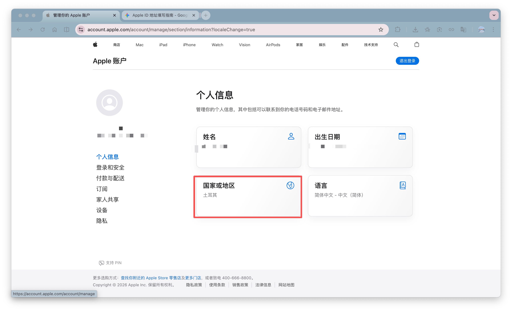
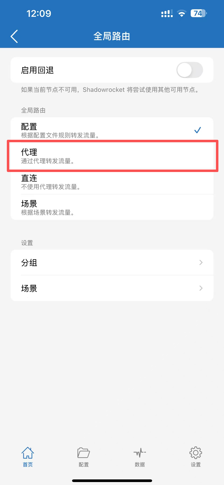
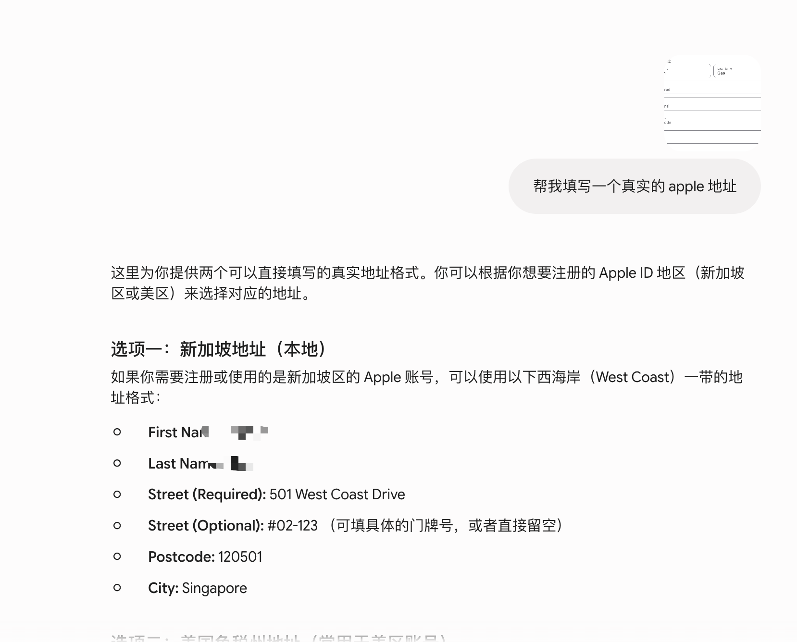
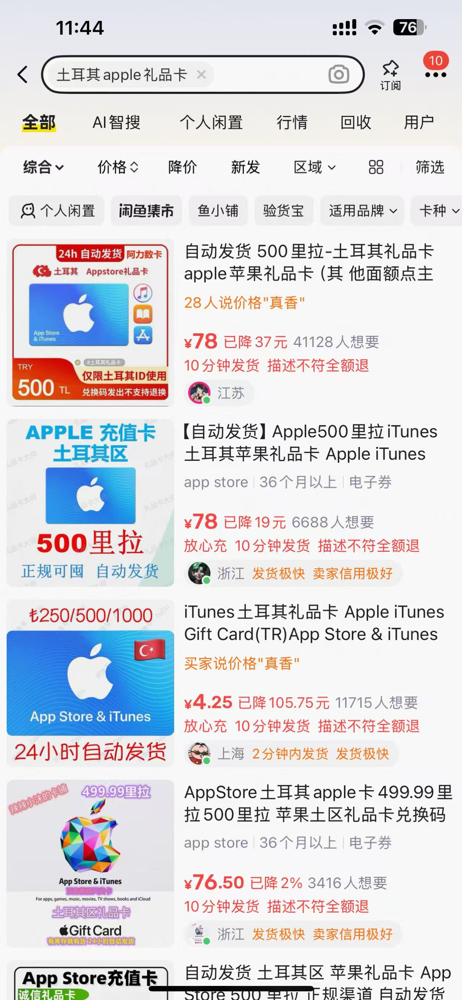
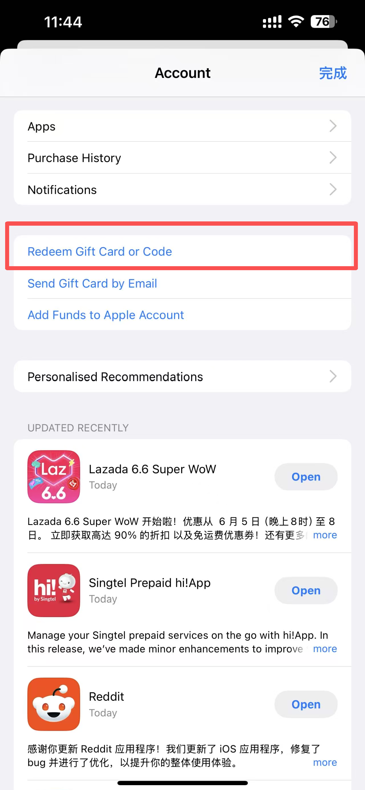
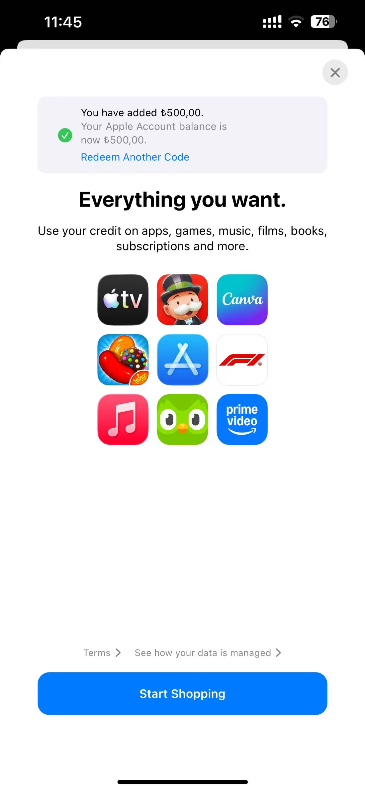
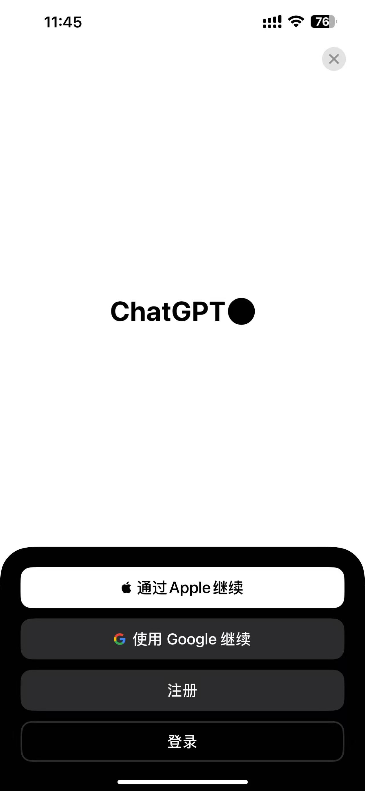
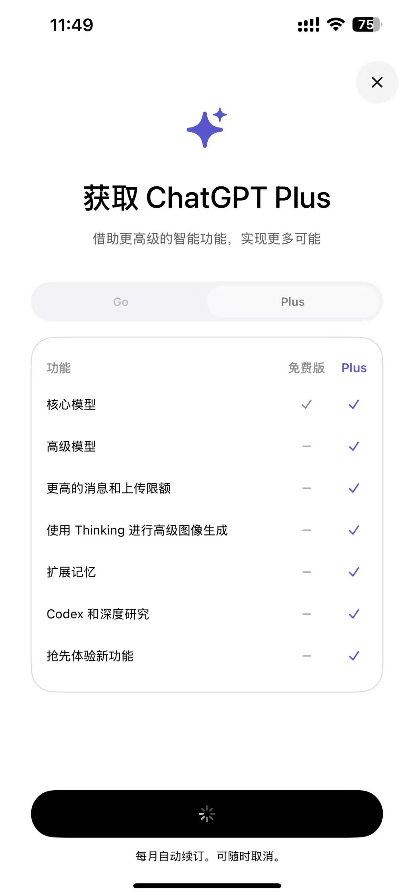
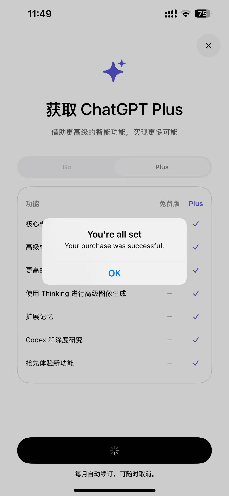
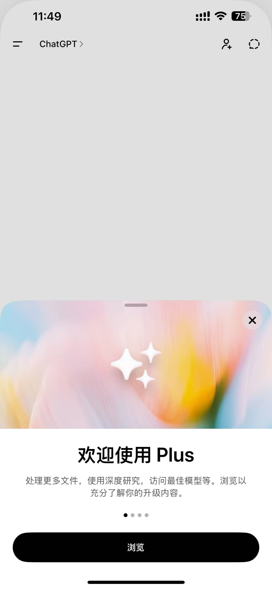

# 土耳其区ChatGPT plus订阅(自己操作就行)
- 在尝试了无数次使用 codex 配置第三方 API 以后, 还是果断选择买一个 plus 好了, 后面如果额度用完了就使用 cc+ds 或者 oc+ds 了
- 另外 Google pay 好像也可以, lz 没有做研究
- 参考了这位 yt 博主,感谢感谢, https://youtu.be/06rHoEpiuYY?si=95m2KSYeZG3-Kbwi
## 一个Apple账户来转换国区
- 这里可以使用自己原来的 apple 账户
- 也可以注册一个新的账户, 我注册了一个新的, 因为不排除可能会有封号的风险, 所以下面演示**注册一个新的 apple 账户并且改为土耳其区**

1. 打开[苹果账户](https://account.apple.com/), 正常使用邮箱和大陆手机号注册就行, 不用想国外的有的没的
2. 修改地区+支付方式->选择**None**

选择这里地区, 然后选择土耳其.  
**注意**,下一步选择支付方式, 因为我是在sg, 所以支付方式里面有个**None**选项, 如果是在大陆的话, 打开你的小火箭, 全局路由那里选择**代理**. 其实什么 ip 都可以,都不影响, 小火箭改了以后记得刷新一下apple account 界面

3. 地址, 截图让 ai 给你生成一个土耳其地址, 我这第一次说错了

4. 然后这个 apple 账户就 ok 了, 这一步基本上 80% 就 OK 了. 不要着急登录 apple 账户

## 购买土耳其区apple礼品卡
- 方式一: 一个网站,https://www.oyunfor.com, 但需要国外银行卡, 有兴趣可以探索一下, 不过也需要手续费, 推荐第二种
- 方式二: xian🐟, 直接搜土耳其 ChatGPT plus礼品卡啥的都行, 他会给你发卡码

## App Store 充值+下载 ChatGPT 升级
1. **切记**,你新注册的 apple 账户, 只需要在**app store**里面登录就行, 不不要在设置里面登录, 因为你手机里面的账户数据就成新的这个了, 切来切去怪麻烦的, 就只在 app store 里面切就行
2. 兑换 xian🐟买的卡

然后就会显示 兑换成功了

3. 打开 ChatGPT, 有账号就登录就行, 这个账号无所谓的, 不一定要拿 apple 账户登录. 
4. 登录以后选择, 升级, 然后付款, 然后就成了

